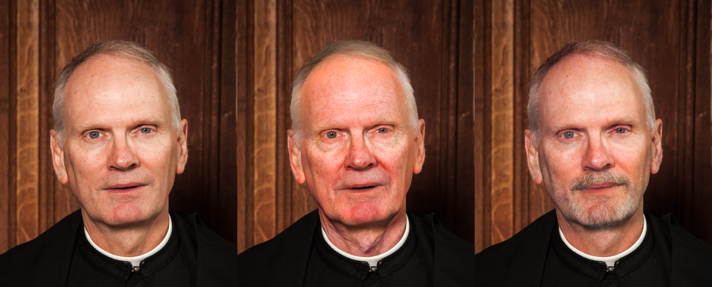
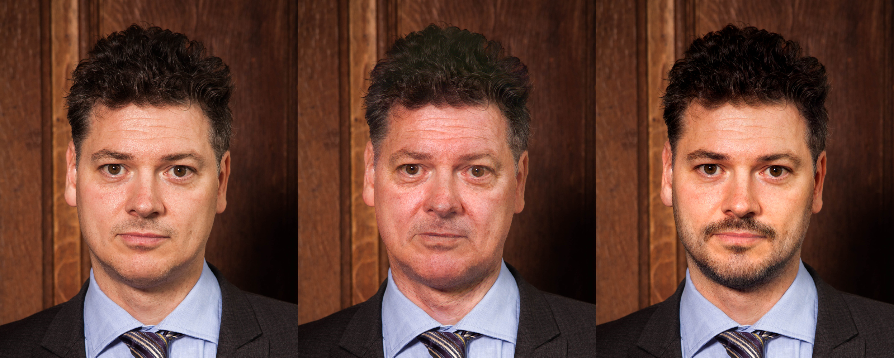
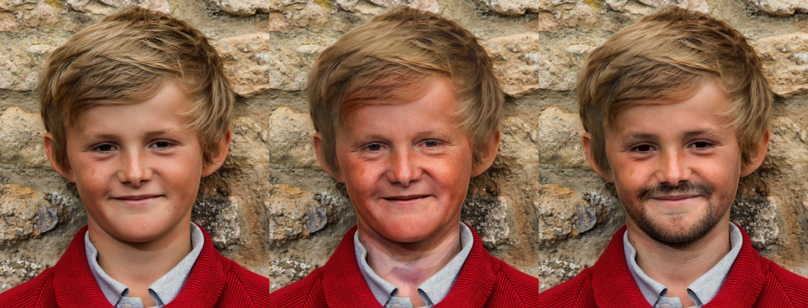

# 1 Introduction

Deep Feature Interpolation (DFI) edits the content of an image by interpolating the feature representations of a deep convolutional neural network. DFI is described in [https://arxiv.org/abs/1611.05507](https://arxiv.org/abs/1611.05507) and will appear at [CVPR 2017](http://cvpr2017.thecvf.com/).

Please cite this paper if you use our work:

Paul Upchurch<sup>1</sup>, Jacob Gardner<sup>1</sup>, Geoff Pleiss, Robert Pless, Noah Snavely, Kavita Bala, Kilian Weinberger. Deep Feature Interpolation for Image Content Changes. In Computer Vision and Pattern Recognition (CVPR), 2017 

<sup>1</sup>Authors contributed equally.
<details>
  <summary>bibtex</summary>
  <pre>@inproceedings{upchurch2017deep,
  title={{D}eep {F}eature {I}nterpolation for Image Content Changes},
  author={Upchurch, Paul and Gardner, Jacob and Pleiss, Geoff and Pless, Robert and Snavely, Noah and Bala, Kavita and Weinberger, Kilian},
  booktitle={Computer Vision and Pattern Recognition (CVPR)},
  year={2017}
}</pre> 
</details>

## 1.1 Requirements

You will need Linux and at least 9 GB of main memory and a recent GPU with at least 6 GB of memory to transform high-resolution images.

The Caffe and Torch deep learning software should be installed so that `import caffe` and `th` work.

Python packages:

```bash
  pip install numpy scikit-image Pillow opencv-python scipy dlib lutorpy execnet torch torchvision
```

# 2 Demonstrations

## 2.1 Demo1


This script produces six kinds of transformations (older, mouth open, eyes open, smiling, moustache, eyeglasses) on LFW faces.

```bash
  python demo1.py
  # ~1.3 minutes to reconstruct each image (using 1 Titan-X)
  # Total time: 9.0 minutes
```

## 2.2 Demo2

  

This script ages or adds facial hair to a front-facing portrait at resolutions up to 1000x1000.

### Preparing an Images Database
This demo requires a database of high resolution images, which is used to select source and target
images for the transformation. Follow the instructions at
[datasets/facemodel/README.md](datasets/facemodel/README.md) to collect the database.

Our method requires that your database contains at least 400 source/target images that match
the gender and facial expression of the input photo. A warning message will be printed if there
are not enough images.

```bash
python demo2.py <transform> <image> --delta <values>

# e.g. python demo2.py facehair images/facemodel/lfwgoogle/Aaron_Eckhart/00000004.jpg --delta 2.5,3.5,4.5
# possible transforms are 'facehair', 'older', or 'younger'
# 2.1 minutes to reconstruct an 800x1000 image (using 1 Titan-X)
# Total time (800x1000 image): 7.5 minutes
```

## 2.3 Demo3


This script fills in missing portions of shoe images.

To reconstruct one of the shoe images:
```bash
  python demo3.py
  # 1.3 minutes to reconstruct each image (using 1 Titan-X)
  # Total time: 1.5 minutes
```

# 3 Options

## 3.1 Reconstruction backend (--backend)

We have two backends. Caffe+SciPy uses Caffe to forward/backward VGG
(GPU) then uses SciPy to call the FORTRAN implementation of L-BFGS-B
(CPU). Torch uses PyTorch to do the entire reconstruction on the
GPU. Torch is faster than Caffe+SciPy but it produces a lower-quality
result. We set Caffe+SciPy to be default for the LFW and UT-Zappos50K
demonstrations and Torch to be the default for the high-res face
demonstration. The Torch model uses more GPU memory so if you run out
of memory you can try the Caffe+SciPy backend.

## 3.2 Interpolation "amount" (--delta)

The `delta` parameter controls how strong a transformation to make. Setting it to zero
results in no transformation at all, and larger numbers result in a stronger
transformation. You can input multiple values, like `--delta 0.1,0.3,0.5` to try
multiple transformations (this will be faster than running them individually).

For most transformations, an ideal `delta` value will be between `0.0` and `1.0`
with `--scaling beta` (between `0.0` and `5.0` with `--scaling none`).

## Speed (--iter)

The `iter` parameter controls how many L-BFGS-B optimization steps are used
for reconstruction. Less steps means less time and lower quality. This
parameter should not be set lower than 150. With `--iter 150` the Torch backend takes 20
seconds to reconstruct a 200x200 image and 3 minutes to reconstruct a 725x1000 image.

## 3.3 Other options

* `--device_id` - if you want to specify a GPU to use
* `--K` - number of nearest neighbors used to construct source/target sets
* `--postprocess color` - matches the color of the final image to match the original image
* `--postprocess mask` - apply a mask (for input foo.jpg the mask should be named foo-mask.png)
